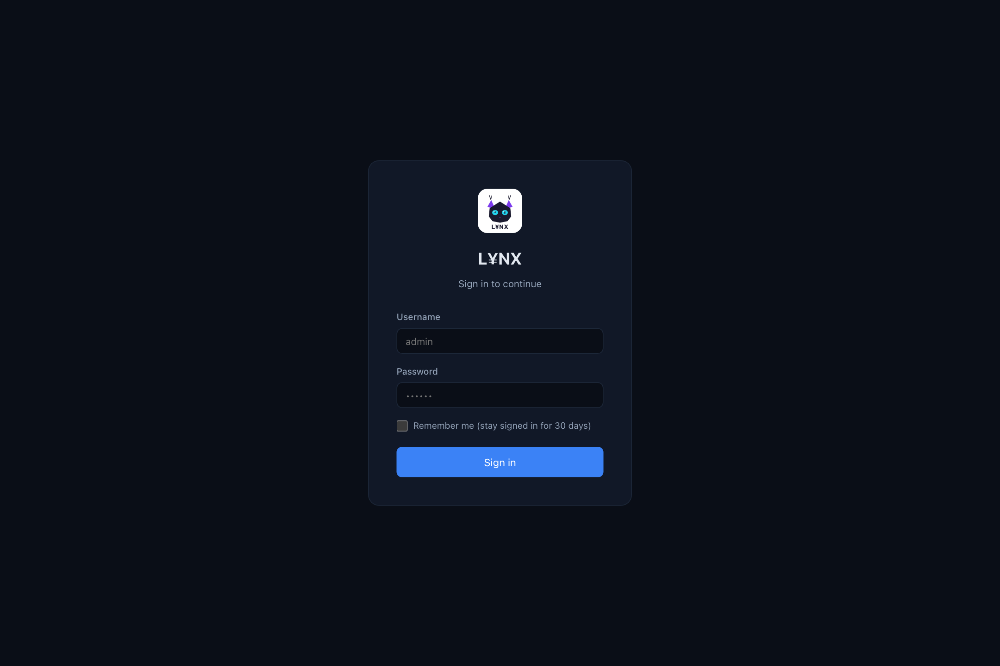
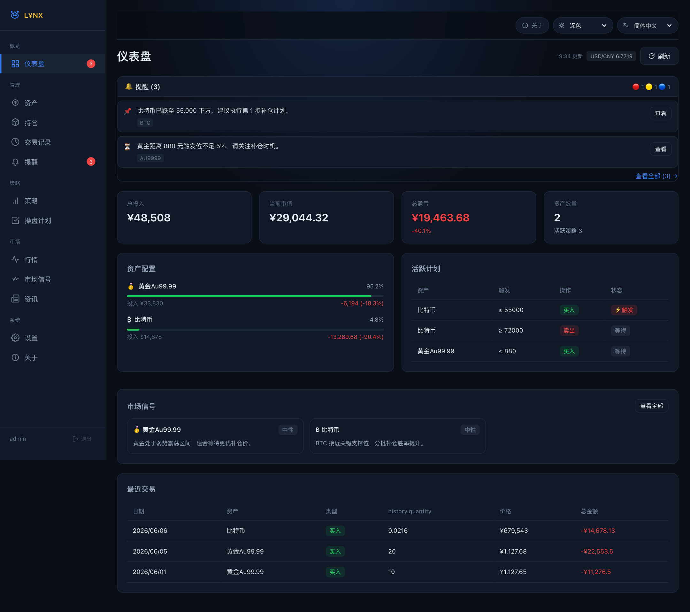
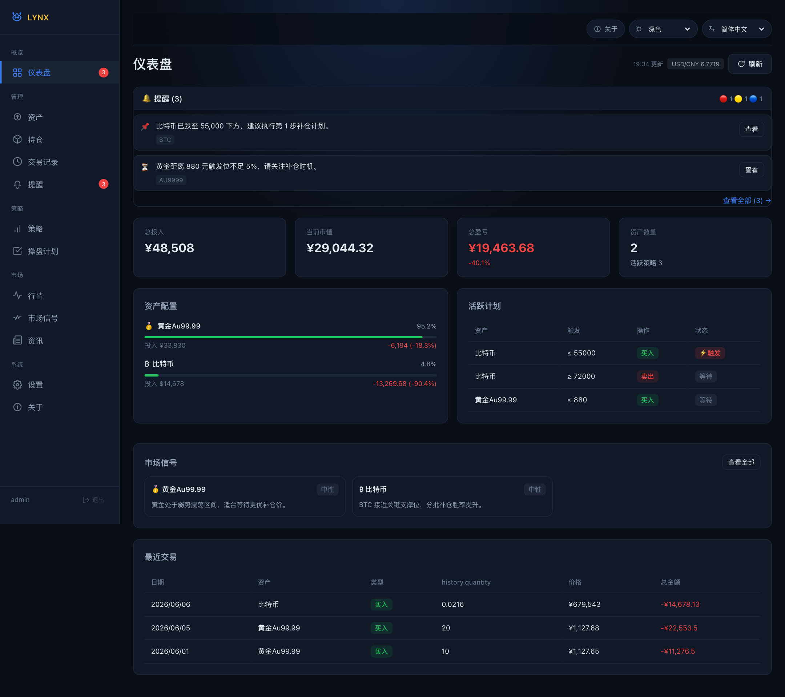
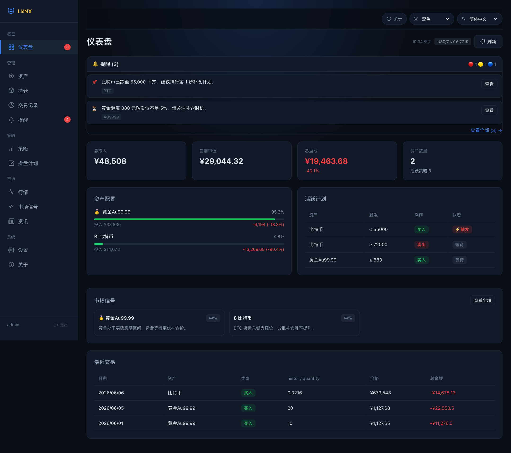
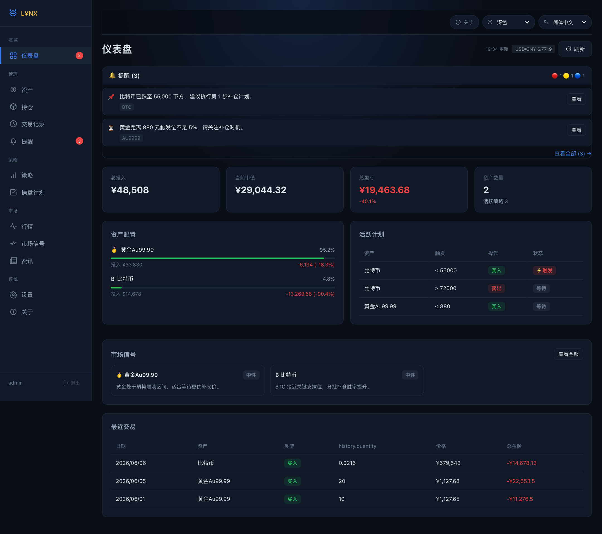
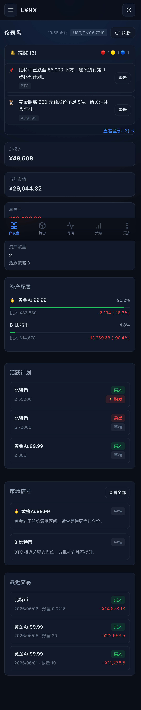
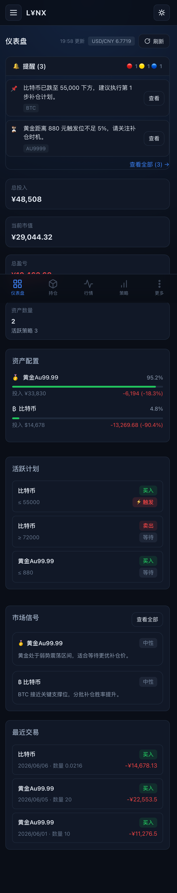
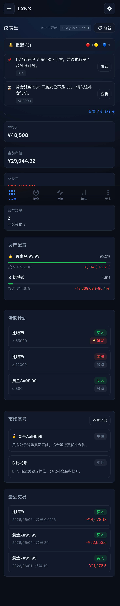

# L¥NX

> 面向个人投资组合的本地化 Web 控制台，聚合资产、持仓、交易、操盘计划、市场信号、资讯与提醒，帮助把“看盘、记账、执行计划、复盘”放到一个系统里。

## 项目名称含义

**L¥NX** 读作 **Lynx**。

- **Lynx** 取自山猫，强调对市场变化的敏捷、警觉与连续观察能力。
- 中间的 **`¥`** 替代字母 **`Y`**，直接指向资金、收益、成本与仓位管理场景。
- 整个名字表达的是：**一个为投资决策服务的、敏锐而克制的个人资产驾驶舱**。

## 系统截图

| 登录页 | 仪表盘 |
| --- | --- |
|  |  |

| 行情中心 | 操盘计划 |
| --- | --- |
|  |  |

| 系统设置 |
| --- |
|  |

## 移动端截图

| 仪表盘 | 行情中心 | 操盘计划 |
| --- | --- | --- |
|  |  |  |

## 核心能力

- **资产与持仓管理**：维护黄金、加密货币、股票等资产信息，自动汇总持仓数量、均价、总投入。
- **交易与执行闭环**：记录买卖交易，联动更新持仓，并支持操盘计划的触发、部分执行与完成归档。
- **组合仪表盘**：集中展示总投入、市值、盈亏、资产权重、近期交易、活跃计划与系统提醒。
- **行情与信号**：缓存市场价格、汇率与 AI/规则生成的市场信号，便于快速判断是否接近执行位。
- **资讯与推送**：支持资讯源管理、定时拉取、Webhook 推送与通知开关配置。
- **多端体验**：Vue 3 + PWA + 响应式布局，同时覆盖桌面侧边栏和移动端底部导航。

## 技术架构

| 层级 | 方案 | 说明 |
| --- | --- | --- |
| 前端 | Vue 3、Vite 7、Pinia、Vue Router、Vue I18n | 单页应用，支持主题/语言切换与 PWA 安装 |
| 后端 | Node.js、Express | 提供认证、资产、策略、市场、通知、系统信息等 API |
| 数据层 | SQLite + better-sqlite3 | 本地文件数据库，迁移脚本自动初始化 |
| 市场能力 | 价格缓存、汇率获取、信号分析、资讯聚合 | 兼顾实时性与接口失败时的可用性 |
| 部署 | Docker、docker compose、多阶段构建 | 前端静态构建后由 Node 服务统一托管 |

## 目录结构

```text
lynx/
├── client/                 # Vue 前端
├── server/                 # Express API + 业务服务
├── migrations/             # SQLite 迁移脚本
├── docker/                 # Dockerfile / compose / 构建推送脚本
├── docs/screenshots/       # README 截图
├── data/                   # 默认数据库目录
├── start.sh                # 本地一键启动脚本
└── package.json            # 根脚本（并发启动前后端）
```

## 快速开始

### 1. 环境要求

- Node.js 24+
- npm 10+
- Docker / Docker Compose（可选）

### 2. 安装依赖

```bash
npm ci
cd client && npm ci
cd ../server && npm ci
cd ..
```

### 3. 开发模式

```bash
npm run dev
```

- 前端：`http://localhost:5173`
- 后端：`http://localhost:3456`
- 默认账号：`admin`
- 默认密码：`admin123`

也可以直接执行：

```bash
bash start.sh
```

### 4. 本地生产模式

```bash
cd client && npm run build
cd ..
node server/index.js
```

构建完成后，后端会自动托管 `client/dist`，统一通过 `http://localhost:3456` 提供服务。

## Docker 部署

### 直接运行现成镜像

```bash
cd docker
docker compose pull
docker compose up -d
```

默认暴露端口：

- 宿主机：`3003`
- 容器内服务：`3456`

### 本地构建并推送镜像

```bash
bash docker/build.sh
```

脚本会完成：

1. 版本号选择与校验
2. 多阶段镜像构建
3. 推送版本标签
4. 可选同步 `latest`
5. 回写 `docker/.env` 中的 `APP_VERSION`

## 关键运行配置

| 变量 | 默认值 | 说明 |
| --- | --- | --- |
| `PORT` | `3456` | 后端监听端口 |
| `DB_PATH` | `data/lynx.db` | SQLite 数据库路径 |
| `JWT_SECRET` | `lynx-invest-jwt-secret` | 登录签名密钥，生产环境必须替换 |
| `AUTH_USERNAME` | `admin` | 后台登录账号 |
| `AUTH_PASSWORD` | `admin123` | 后台登录密码，生产环境必须替换 |
| `AUTH_GATEWAY_PORT` | `19000` | 金价代理端口 |
| `AI_API_URL` / `AI_API_KEY` / `AI_MODEL` | 空 / 空 / `gpt-4o-mini` | AI 策略生成与分析配置 |

## 安全建议

- 首次部署后立即修改 `AUTH_USERNAME`、`AUTH_PASSWORD`、`JWT_SECRET`
- 将 `data/` 挂载到持久化存储，避免容器重建后数据丢失
- 若启用 AI / 推送能力，优先通过环境变量或受控配置注入密钥，不要写入仓库
