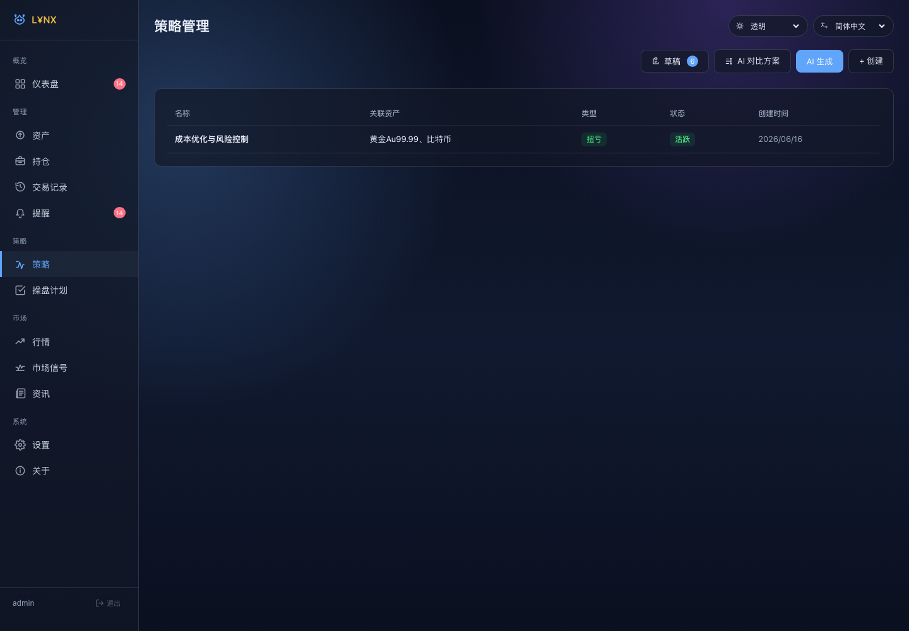
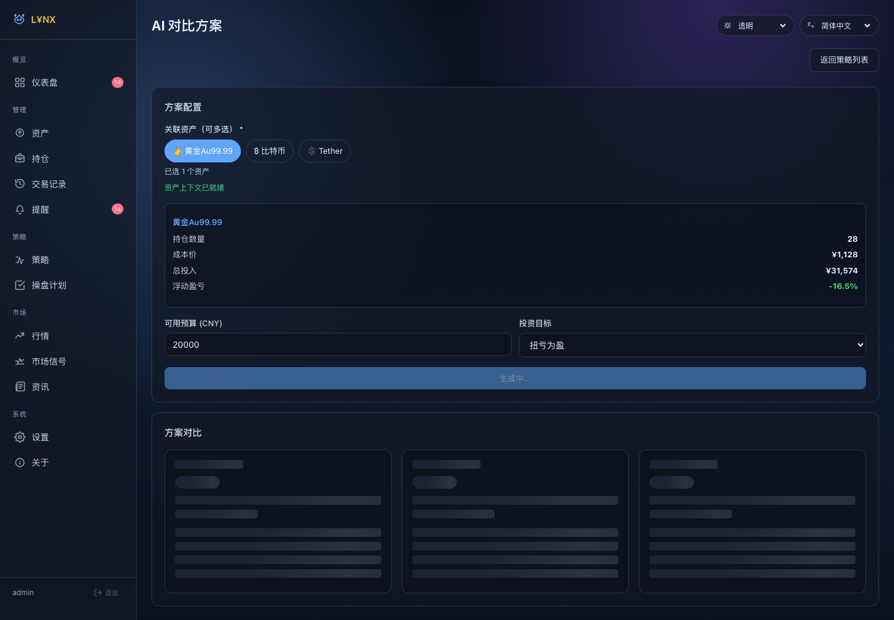
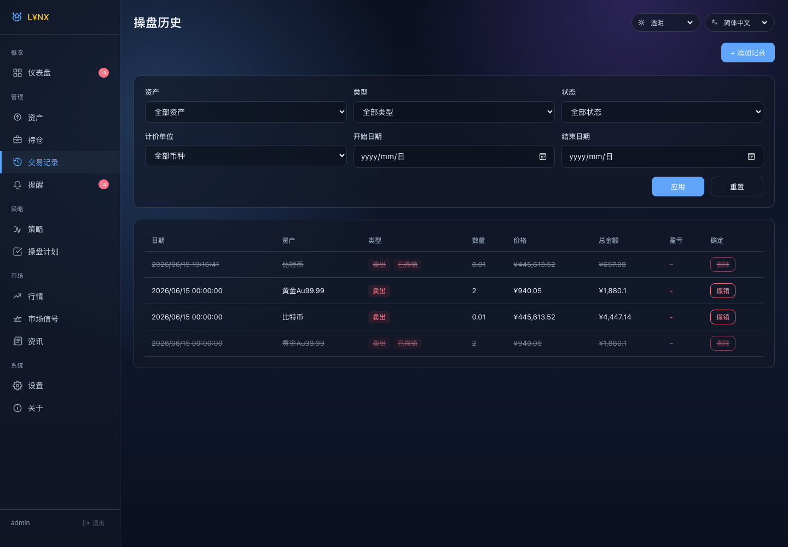
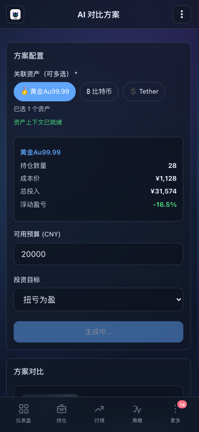

# L¥NX

> 面向个人投资组合的本地化 Web 控制台，聚合资产、持仓、交易、策略 Agent、操盘计划、行情信号、资讯与提醒，帮助把“看盘、记账、生成计划、执行、复盘”放到一个系统里。

**L¥NX** 读作 **Lynx**，中文名：**灵猞**，Lynx 取自猞猁，强调对市场变化的敏捷、警觉与连续观察能力；中间的 **`¥`** 指向资金、收益、成本与仓位管理场景。整体定位是：**一个为投资决策服务的、敏锐而克制的个人资产驾驶舱**。


## 系统截图

### 桌面端

| 登录页 | 仪表盘 |
| --- | --- |
|  |  |

| 行情中心 | 操盘计划 |
| --- | --- |
|  |  |

| 策略管理 | 策略 Agent 流式进度 |
| --- | --- |
|  |  |

| 操盘历史 | 系统设置 |
| --- | --- |
|  |  |

### 移动端

| 仪表盘 | 行情中心 | 操盘计划 | 策略 Agent |
| --- | --- | --- | --- |
|  |  |  |  |

## 核心能力

### 资产、持仓与交易

- **多资产档案**：维护黄金、加密货币、股票等资产，支持图标、币种、数据源等基础信息。
- **持仓汇总**：按资产计算数量、均价、投入、市值、盈亏和组合权重，统一折算到基础币种展示。
- **统一交易历史**：买入/卖出流水统一写入 `trade_history`，联动更新持仓，并保留策略、计划批次和归因来源用于复盘和 Agent 分析。
- **分页复盘**：操盘历史页使用后端 `limit` / `offset` 分页查询，支持资产、类型、状态、币种、时间和排序过滤。

### 仪表盘与复盘

- **组合总览**：展示总投入、总市值、浮动盈亏、资产配置、近期交易、活跃计划和最新市场信号。
- **收益趋势**：基于行情缓存与持仓数据生成组合收益趋势，用于观察计划执行后的变化。
- **告警聚合**：统一展示计划触发、接近触发、止损、价格波动等通知事件。

### 策略与操盘计划闭环

- **策略管理**：支持单资产和多资产策略，策略可手工创建，也可由 AI 生成后确认采用。
- **计划批次**：策略生成或再生成计划时会创建 `plan_sets` 批次；旧计划自动归档为 superseded，避免旧计划交易混入当前策略复盘。
- **执行归因**：执行计划会写入统一交易历史，并记录 `plan_id`、`strategy_id`、`plan_set_id` 和归因来源 `plan_execute`。
- **部分执行**：计划支持触发、部分执行、完成、取消等状态，执行时会校验成交价、数量和剩余计划量。

### 策略 Agent

系统内置策略 Agent，使用 SSE 流式推送进度，前端以“策略 Agent 工作中”浮层展示实时步骤、数据质量和质量评分。

Agent 主要流程：

1. **配置检查**：校验 AI API、模型、资产选择等必需条件。
2. **收集数据**：汇总资产、持仓、交易、行情缓存、新闻、已有策略与触发计划。
3. **市场研判**：生成结构化市场分析与风险判断。
4. **自洽验证**：检查分析完整性、一致性和数据质量。
5. **生成策略**：输出策略说明、计划列表、资金安排和风险控制。
6. **约束校验**：校验预算、计划字段、买卖约束，并尽量自动修正。
7. **质量评估**：计算结果评分、等级与可采用性。

Agent 相关能力：

- **流式进度**：`/api/strategies/ai-agent-generate` 使用 `text/event-stream` 返回 `progress`、`result`、`error` 事件。
- **草稿机制**：AI 生成结果先保存到 `ai_generation_logs`，用户确认后再采用为正式策略和计划。
- **失败恢复**：`agent_resume_checkpoints` 保存关键中间结果，可基于原参数继续执行。
- **可观测性**：`agent_traces` 与 `agent_artifacts` 保存运行步骤、Prompt、LLM 原始响应、解析结果和校验报告，便于追溯与排查。
- **韧性控制**：支持 LLM 重试次数配置和熔断保护，减少临时 API 故障对系统体验的影响。

### 行情、信号与资讯

- **行情缓存**：所有资产价格写入 `price_cache`，默认 5 分钟新鲜窗口；接口失败时优先展示缓存快照。
- **多行情源**：BTC 默认支持 CoinGecko、Binance、Coinbase、Kraken、OKX、Bitstamp、Gemini；黄金默认支持 neodata 与 Swissquote。
- **手工价格**：支持手动写入单个资产价格，便于接口不可用或特殊资产补录。
- **汇率服务**：支持 USD/CNY 汇率缓存，用于跨币种组合汇总。
- **市场信号**：可对单资产或全部资产执行信号分析，并在仪表盘展示最新信号。
- **资讯缓存**：支持内置资讯源、自定义资讯源、定时刷新、正文缓存和批量缓存。

### 设置、推送与多端体验

- **运行时设置**：市场刷新、行情源、资讯源、推送、通知事件、AI/Agent 配置均可在设置页维护。
- **Webhook 推送**：支持企业微信等 Webhook 类型，并提供测试发送。
- **主题与语言**：支持主题、语言和涨跌色配置。
- **PWA 与响应式布局**：桌面端侧边栏 + 移动端底部导航，支持移动端安装使用。

## 技术架构

| 层级 | 方案 | 说明 |
| --- | --- | --- |
| 前端 | Vue 3、Vite 7、Pinia、Vue Router、Vue I18n、PWA | 单页应用，支持响应式布局、主题/语言切换、移动端安装 |
| 后端 | Node.js 24、Express | 提供认证、资产、持仓、交易、策略、计划、行情、资讯、通知、系统设置等 API |
| 数据层 | SQLite、better-sqlite3、WAL | 本地文件数据库，启动时自动执行 `migrations/` 迁移 |
| Agent | SSE、LLM Chat Completions 兼容接口、Trace/Artifacts | 流式生成策略，保存运行轨迹、恢复检查点和质量评估 |
| 市场能力 | 多行情源、价格缓存、汇率缓存、信号分析、资讯聚合 | 兼顾实时性、可用性和接口失败回退 |
| 部署 | Docker、docker compose、多阶段构建 | 前端构建产物由 Node 服务统一托管 |

## 目录结构

```text
lynx/
├── client/                 # Vue 前端
│   ├── src/components/     # 通用组件、Agent 进度浮层、表单、图表等
│   ├── src/views/          # 登录、仪表盘、资产、策略、计划、行情、资讯、设置等页面
│   ├── src/stores/         # Pinia 状态
│   └── src/utils/          # API、提示、确认弹窗、版本等工具
├── server/                 # Express API + 业务服务
│   ├── routes/             # REST/SSE 路由
│   ├── services/           # Agent、行情、信号、新闻、推送、回测、压力测试等服务
│   ├── db/                 # SQLite 连接与迁移执行
│   └── utils/              # 日志、时间处理等工具
├── migrations/             # SQLite 迁移脚本
├── docker/                 # Dockerfile / compose / 构建推送脚本
├── docs/screenshots/       # README 截图
├── data/                   # 默认 SQLite 数据库目录
├── start.sh                # 本地一键启动脚本
└── package.json            # 根脚本（并发启动前后端）
```

## 快速开始

### 环境要求

- Node.js 24+
- npm 10+
- Docker / Docker Compose（可选）

### 安装依赖

```zsh
npm ci
cd client && npm ci
cd ../server && npm ci
cd ..
```

### 开发模式

```zsh
npm run dev
```

默认地址：

- 前端：`http://localhost:5173`
- 后端：`http://localhost:3456`
- 健康检查：`http://localhost:3456/api/health`

默认登录账号：

- 用户名：`admin`
- 密码：`admin123`

也可以直接执行一键启动脚本：

```zsh
bash start.sh
```

> 后端启动时会自动执行 `migrations/` 下尚未应用的 SQL 迁移，并在 `data/lynx.db` 创建或更新本地数据库。

### 本地生产模式

```zsh
cd client && npm run build
cd ..
node server/index.js
```

构建完成后，后端会自动托管 `client/dist`，统一通过 `http://localhost:3456` 提供服务。

## Docker 部署

### 直接运行镜像

```zsh
cd docker
docker compose pull
docker compose up -d
```

默认端口：

- 宿主机：`3003`
- 容器内服务：`3456`

默认数据卷：

- `../data:/app/data:rw`

### 本地构建并推送镜像

```zsh
bash docker/build.sh
```

脚本会完成：

1. 版本号选择与校验
2. 多阶段镜像构建
3. 推送版本标签
4. 可选同步 `latest`
5. 回写 `docker/.env` 中的 `APP_VERSION`

## 关键运行配置

部分配置可通过环境变量设置，部分也可以在系统设置页保存到 `settings` 表。

| 配置 | 默认值 | 说明 |
| --- | --- | --- |
| `PORT` | `3456` | 后端监听端口 |
| `DB_PATH` | `data/lynx.db` | SQLite 数据库路径 |
| `JWT_SECRET` | `lynx-invest-jwt-secret` | 登录签名密钥，生产环境必须替换 |
| `AUTH_USERNAME` | `admin` | 后台登录账号 |
| `AUTH_PASSWORD` | `admin123` | 后台登录密码，生产环境必须替换 |
| `AUTH_GATEWAY_PORT` | `19000` | neodata 金价代理端口 |
| `AI_API_URL` / `AI_API_KEY` / `AI_MODEL` | 空 / 空 / `gpt-4o-mini` | AI 策略生成与 Agent 默认模型配置 |
| `AGENT_LLM_RETRIES` | `3` | Agent LLM 调用重试次数，系统设置中的 `agent_llm_retries` 优先级更高 |
| `AGENT_SEARCH_API_URL` / `AGENT_SEARCH_API_KEY` | 空 / 空 | Agent 可选外部搜索接口配置 |
| `APP_VERSION` | `dev` | 前端构建与关于页展示版本，Docker 构建时注入 |
| `TZ` | `Asia/Shanghai`（Docker） | 运行时区 |

常用设置项会写入 `settings` 表，包括：

- `market_btc_sources_enabled`、`market_gold_sources_enabled`
- `market_refresh_interval`、`refresh_interval`、`rate_cache_duration`
- `strategy_monitor_interval`、`signal_valid_hours`、`plan_approaching_pct`
- `news_refresh_interval`、`news_sources_enabled`、`news_auto_cache`、`news_cache_batch_size`
- `push_enabled`、`push_webhook_type`、`push_webhook_url`
- `ai_api_url`、`ai_api_key`、`ai_model`、`agent_analysis_model`、`agent_llm_retries`

## 主要 API 模块

| 模块 | 路由前缀 | 说明 |
| --- | --- | --- |
| 认证 | `/api/auth` | 登录与 token 验证 |
| 资产/持仓/历史 | `/api/assets`、`/api/holdings`、`/api/history` | 资产档案、持仓汇总、统一交易历史与分页复盘 |
| 兼容交易流水 | `/api/transactions` | 旧交易流水接口，当前主要页面使用 `/api/history` 形成持仓与归因闭环 |
| 仪表盘 | `/api/dashboard` | 组合总览、趋势、告警、配置 |
| 策略与 Agent | `/api/strategies` | 策略 CRUD、AI 生成、Agent SSE、草稿采用、Trace 查询 |
| 操盘计划 | `/api/plans` | 计划列表、触发、执行、取消、归因交易 |
| 行情与信号 | `/api/market`、`/api/signals` | 价格、汇率、趋势、手工价格、市场信号 |
| 资讯 | `/api/news` | 资讯列表、刷新、正文缓存、自定义源 |
| 设置与通知 | `/api/settings`、`/api/notifications` | 运行时设置、推送、通知事件 |
| 系统 | `/api/system` | 系统信息与运行状态 |

除 `/api/health` 和 `/api/auth` 外，API 默认需要登录 token。

## 数据与备份

- 默认数据库：`data/lynx.db`
- SQLite 使用 WAL 模式，运行时可能同时出现 `lynx.db-shm` 和 `lynx.db-wal`
- Docker 部署时请持久化挂载 `/app/data`
- 备份时建议停止服务或使用 SQLite 在线备份方式，避免只复制主库遗漏 WAL 内容

## 安全建议

- 首次部署后立即修改 `AUTH_USERNAME`、`AUTH_PASSWORD`、`JWT_SECRET`
- 不要将真实的 `AI_API_KEY`、`agent_search_api_key`、Webhook 地址写入仓库
- 生产环境建议仅在可信内网或反向代理认证之后暴露服务
- 定期备份 `data/`，升级前先备份数据库

## 许可证

L¥NX 采用自定义 **Source Available Non-Commercial License**：源码可见，允许个人学习、研究、评估、非商业自托管和非商业修改。

未经版权持有人事先书面授权，禁止任何商业用途，包括但不限于：

- 企业、组织或政府机构内部使用；
- 商业产品或商业服务集成；
- SaaS、托管服务、云服务、多租户服务；
- 付费部署、咨询、定制、培训、维护或技术支持；
- 为客户提供私有化交付；
- 修改后或未修改版本的商业分发、转售；
- 用于向第三方提供投资、金融、资产管理、投顾、分析、自动化或报表服务。

详情见：

- [`LICENSE`](./LICENSE)
- [`COMMERCIAL-LICENSE.md`](./COMMERCIAL-LICENSE.md)

## 说明

L¥NX 是个人投资决策辅助与记录系统，不是自动交易系统：不会自动下单、不会托管交易账户，也不构成投资建议。所有策略、信号和 AI 生成内容都应由使用者自行判断后再执行。
